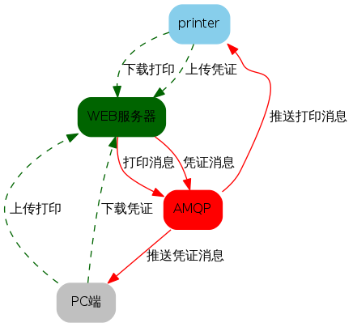
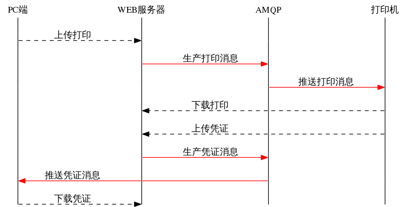
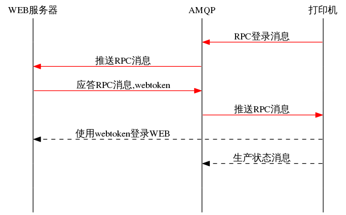
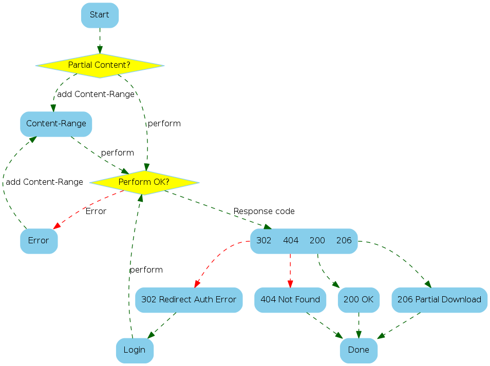
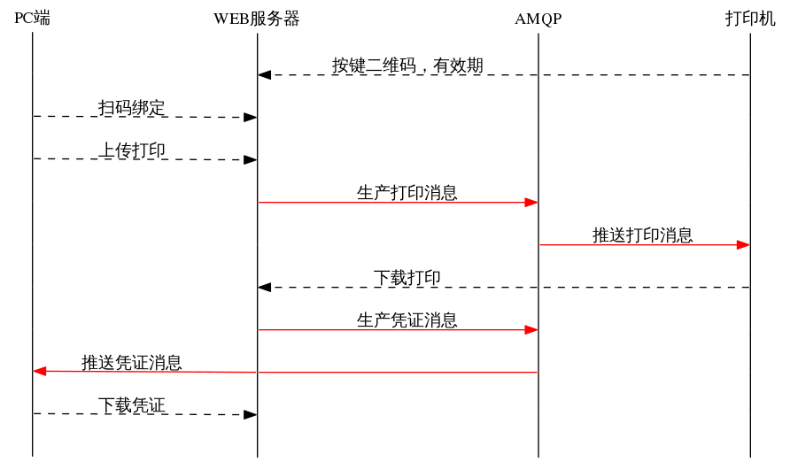

网络打印服务器文档(初稿)
=================

## 1.简介
 &ensp;&ensp; 本服务器是由WEB服务器与AMQP服各器构成，实现以轻量级的消息来驱动业务逻辑，同时解决服务器开发中的并发性能，服务器的弹性扩展问题。
 
### 功能模块
##### 登录注册
* 注册功能
	* 注册验证（图形码，短信)

* 找回密码
	* 邮箱找回
	* 短信找回

##### 打印历史
* 用户打印统计
	* 打印机历史
	* 用户所有打印历史报表

##### 打印机管理
* 绑定管理
	* 创建绑定
	* 删除绑定
	* 绑定列表

* 分享打印管理
	* 创建分享
	* 删除分享（某用户）
	* 收回所有分享


## 2.流程图与时序图
#### &ensp;&ensp; 打印流程图

---
#### &ensp;&ensp; 打印时序图

---
#### &ensp;&ensp; 打印机登录时序图



#### &ensp;&ensp; 打印机下载文件状态图


---
## 功能需求(设想)
#### 长期分享
&ensp;&ensp;设用户A对打印机A有所有权（绑定），用户A想分享该打印机给某些人用。同时用户A可以对分享到的该打印机的其它用户做出如下回应：拒绝，删除，拉黑。对打印机分享功能进行回收。
对于机主分享他的打印机，可以采用：咨询授权方式（加好友方式 ），通知方式（红包方式）。


#### 短期分享

用户在目标打印机上，按键打印一张二维码（有效期十分钟），扫码做临时绑定后可对它进行打印任务。



## 4. HTTP API

### 图形验证码
* URL: /v1.0/captcha
* 请求方式: GET
* 参数： 无
* 成功返回PNG格式图片，提交时字符不区分大小写。


### 用户注册
* URL: /v1.0/user/signup
* 请求方式： POST
* 参数：
|参数名  | 描述  |必填|
|-----|:----:|:---|
|username|用户名 |yes|
|password|用户密码|yes|
|email | 电子邮箱|no |
|phone | 手机号码| no|
|captcha| 验证码| yes|

* 成功返回 OK

### 用户登录
* URL: /v1.0/user/login
* 请求方式： POST
* 参数：

|参数  | 描述  |必填|
|-----|:----:|:--:|
|username|用户名 |yes|
|password|用户密码|yes|

* 返回格式，JSON
* 成功后跳转到 /v1.0/user/login/success ，返回JSON 例如: **{"id":607,"uuid":"307b9e4d-de76-4963-a1c4-eb045091372c"}**


### 绑定打印机
 * URL: /v1.0/user/private/bind/create/{name}
 * 请求方法： POST
 * 参数,必须是登录状态
|参数  |类型| 描述  |必填|
|-----|----|:----:|:----:|
|name|string| 打印机的名字|yes|

*  成功：返回OK。


### 获取绑定列表 
* URL: /v1.0/user/private/bind/list
* 请求方法： POST，GET
* 参数： 无，必须是登录状态
*  成功： 返回JSON列表。
```
{'list': [{'alias': 'tyryy',
   'driver': 'printer Type-1124Z',
   'id': 1568,
   'name': '226435301',
   'uuid': '82e68c55-6704-43aa-bab3-d5a14e1e823f'},
  {'alias': 'printer',
   'driver': 'Printer  GP-1124Z',
   'id': 1569,
   'name': '4157561886',
   'uuid': 'cfa6860a-2001-4584-a317-a657bf91ae12'}]}
```
---
* 返回值参数说明
|键名  |类型| 描述  |
|-----|----|:----:|
|list |string| 例表对像名，该对像下面的元数个数就是该用户所绑定的用户数量|
|alias|string|打印机别名，可修改|
|driver|string|打印机的驱动型号|
|id|long|打印机的ID唯一|
|name|string|打印用名称|
|uuid|string|打印机的UUID，唯一|

### 上传文件 
* URL:  /v1.0/user/private/upload
* 请求方法： POST
* 参数： 登录状态
|参数  | 描述  |必填|
|-----|:----:|:---:|
|pages|本次上传文件的打印页数|yes|
|rpid|远端打印机的ID|yes|
|key|AMQP的消息密码|yes|
|lpname|发起打印的打印机名称|yes|
|file|上传的文件名|yes|

*  成功：返回OK。


### 下载凭证
* URL: /v1.0/user/private/getbmp/{uuid}
* 请求方法： GET
* 参数： 登录状态
* |参数  | 描述  |必填|
|-----|:----:|:---:|
|uuid|从消息里收到的UUID|yes|

*  成功：返回bmp的字节流。

## 5.API错误码

* 请求出错（非500服务器内部错误),会返回一个JSON描述错误信息。
* 例如: **{"code":40104,"message":"无效的验证码"}**

#### 400 状态码

|错误码|描述|
|:---:|:----:|
|40001|URL输入错误|
|40002|用户名或者密码输入错误|
|40003|创建用户请求体未提供”username”|
|40004|创建用户请求体未提供”password”|
|40005|发送请求时请求体不符合标准的JSON格式，服务器无法正确解析|
|40006|用户名已存在|
|40007|修改用户密码的请求体没提供newpassword属性|
|40008|手机号格式不正确|
|40009|请选择一个文件上传|

#### 401 状态码

|错误码|描述|
|:---:|:----:|
|40101|发送请求时使用的token错误|
|40102|token过期|
|40103|无效token|
|40104|无效的验证码|

#### 404 状态码

|错误码|描述|
|:---:|:----:|
|40401|目标打印机不存在|
|40402|无法找到该文件|


